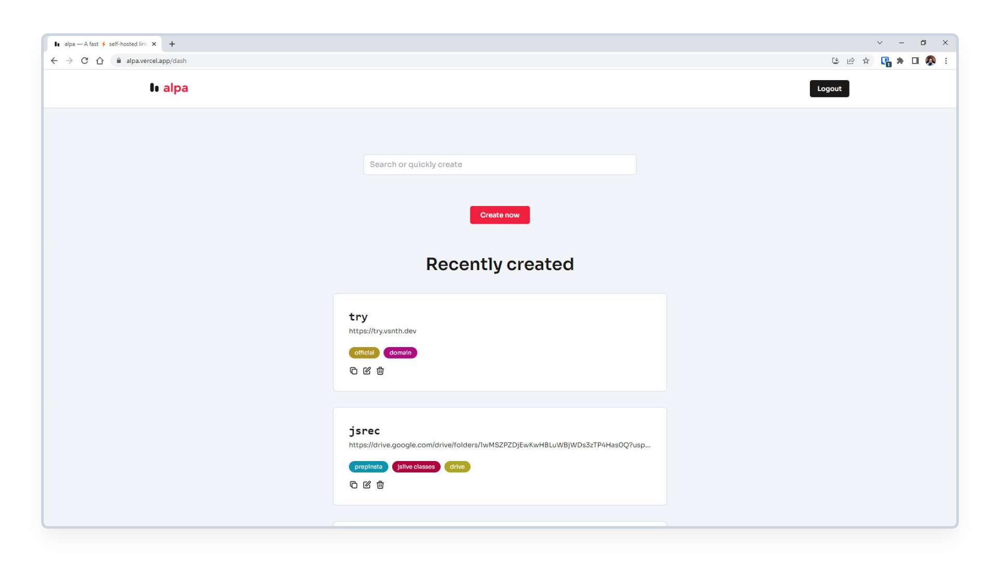

<br>
<h1 align="center">
    <a href="https://alpa.vercel.app#gh-light-mode-only" target="_blank" rel="noopener">
        
    </a>
    <a href="https://alpa.vercel.app#gh-dark-mode-only" target="_blank" rel="noopener">
        
    </a>
</h1>



<p align="center"><strong>( अल्प ) — A fast ⚡ self-hosted link 🔗 shortener.</strong></p>

<p align="center">
    <a href="https://github.com/vsnthdev/alpa/issues">
        
    </a>
    <a href="https://github.com/vsnthdev/alpa/commits/main">
        
    </a>
    <a href="https://hub.docker.com/r/vsnthdev/alpa-api" target="_blank" rel="noopener">
        
    </a>
    <a href="https://alpa.vercel.app" target="_blank" rel="noopener">
        
    </a>
</p>

<br>

<!-- block:header -->

**alpa** is a self-hosted _(you run it on your servers)_ URL shortener which is fast and provides full control of the short links you create.

It takes this 👇

```plaintext
https://vasanthdeveloper.com/migrating-from-vps-to-kubernetes
```

and converts it into something like this 👇

```plaintext
https://vas.cx/fjby
```

Which is easier to remember and share across the internet.

## ✨ Features

- **It is 🚀 super fast**
- **Your domain, your branding** 👌
- **Privacy friendly 🤗 & configurable**
- **Simple & 🎮 intuitive dashboard**

## 💡 Why I built it?

I was using <a href="https://en.wikipedia.org/wiki/Google_URL_Shortener" target="_blank" rel="noopener">goo.gl</a> back in 2016 and I was very impressed by it. It's simple dashboard & fast redirection were two things that were really attractive to me. **alpa** is inspired by goo.gl URL shortener.

Along with that, most popular URL shorteners are not _self-hosted_, which means that you'll share your data with others that use the service. To me, it was a concern about **reliability**, **privacy** and **performance**.

## 🚀 Quick start

The quickest way to run **alpa** is through <a href="https://docs.docker.com/compose" target="_blank" rel="noopener">Docker Compose</a> using only **3 steps**:

**STEP 1️⃣** Getting alpa

Once you have Docker Compose installed, clone this repository by running the following command 👇

```
git clone https://github.com/vsnthdev/alpa.git
```

**STEP 2️⃣** Creating a configuration file

Enter into the **alpa** directory and create an API config by running 👇

```
cd ./alpa
cp ./api/config.example.yml ./api/config.yml
```

**⚠️ Warning:** The example config file is only meant for development and testing purposes, a proper config file is required to securely run **alpa** in production.

**STEP 3️⃣** Starting alpa

Now all you need to do is, run the following command to start both **alpa**'s [app](https://github.com/vsnthdev/alpa/tree/main/app) & the [API](https://github.com/vsnthdev/alpa/tree/main/api).

```
docker-compose up -d
```

## ⚡ Support & funding

Financial funding would really help this project go forward as I will be able to spend more hours working on the project to maintain & add more features into it.

Please get in touch with me on [Discord](https://discord.com/users/492205153198407682) or [Twitter](https://vas.cx/twitter) to get fund the project even if it is a small amount 🙏

## 🤝 Troubleshooting & help

If you face trouble setting up **alpa**, or have any questions, or even a bug report, feel free to contact me through Discord. I provide support for **alpa** on [my Discord server](https://vas.cx/discord).

I will be happy to consult & personally assist you 😊

## 💖 Code & contribution

**Pull requests are always welcome** 👏

But it will be better if you can get in touch with me before contributing or [raise an issue](https://github.com/vsnthdev/alpa/issues/new/choose) to see if the contribution aligns with the vision of the project.

> **ℹ️ Note:** This project follows [Vasanth's Commit Style](https://vas.cx/commits) for commit messages. We highly encourage you to use this commit style for contributions to this project.

## 💻 Building & Dev Setup

This is a [monorepo](https://monorepo.tools/#what-is-a-monorepo) containing multiple projects. Below is a list of all the projects in this repository, what they do, and docs to building them 👇

| Name | Description |
| --- | --- |
| [@alpa/api](./api) | The core RESTful API 🛠️ that handles redirection in alpa. |
| [@alpa/app](./app) | Dashboard ✨ to interact with alpa's API. |
| [@alpa/docs](./docs) | Programmatically ⚡ builds docs 📚 of all projects 📂 under alpa. |

### 🛠️ Building all projects

You need to be at least on **Node.js v17.4.0 or above** and follow the below instructions to build all the projects 👇

- **STEP 1️⃣**  Clone this repository & enter into it (`cd ./alpa`)
- **STEP 2️⃣**  Run **`npm install`** to get all dependencies & link projects together
- **STEP 3️⃣**  To build all the projects & docs run **`npm run build`**

### 🐳 Building Docker images

Instead of pulling Docker images from DockerHub, you can build yourself by running 👇

```
npm run build:docker
```

> ⚠️ **Warning:** Make sure to delete Docker images pulled from DockerHub or a previous build, to prevent conflicts before running the above command.

### 🍃 Cleaning project

Building the project generates artifacts on several places in the project. To delete all those artifacts **(including docs)**, run the below command 👇

```
npm run clean
```

<!-- block:footer -->

## 📰 License
> The **alpa** project is released under the [AGPL-3.0-only](https://github.com/vsnthdev/alpa/blob/main/LICENSE.md). <br> Developed &amp; maintained By Vasanth Srivatsa. Copyright 2022 © Vasanth Developer.
<hr>

> <a href="https://vsnth.dev" target="_blank" rel="noopener">vsnth.dev</a> &nbsp;&middot;&nbsp;
> YouTube <a href="https://vas.cx/videos" target="_blank" rel="noopener">@vasanthdeveloper</a> &nbsp;&middot;&nbsp;
> Twitter <a href="https://vas.cx/twitter" target="_blank" rel="noopener">@vsnthdev</a> &nbsp;&middot;&nbsp;
> Discord <a href="https://vas.cx/discord" target="_blank" rel="noopener">Vasanth Developer</a>
